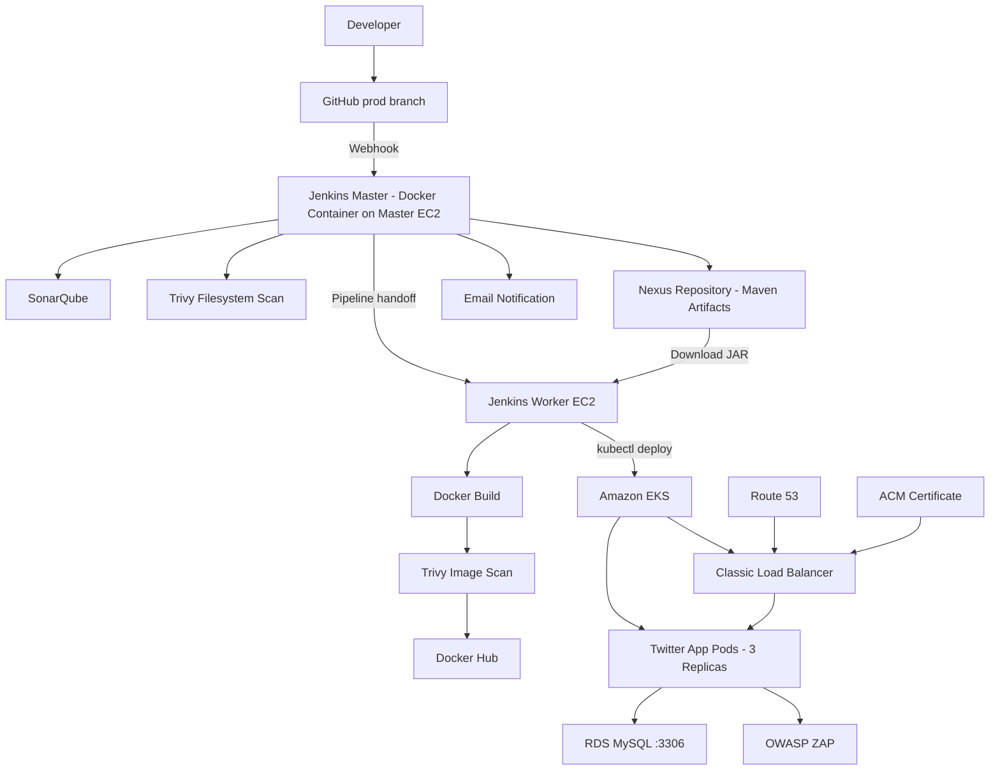
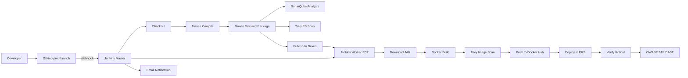
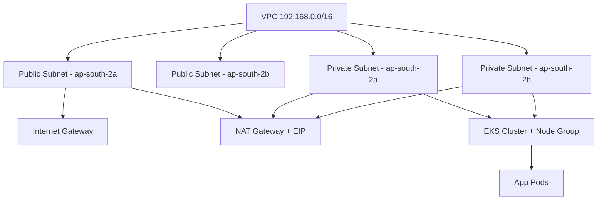

# 🐦 Twitter DevSecOps CI/CD Project

**End-to-End Cloud-Native DevSecOps Implementation on AWS**

An end-to-end AWS DevSecOps implementation that automatically takes code from GitHub through Jenkins, Maven, SonarQube, Trivy and Nexus, builds and scans a Docker image, publishes it to Docker Hub, deploys it to private-node Amazon EKS, exposes it securely through a Load Balancer with Route 53 and ACM, connects to RDS MySQL, validates the deployed application using OWASP ZAP, and reports the pipeline result via email.

```
GitHub → Jenkins Master → Maven / SonarQube / Trivy → Nexus → Jenkins Worker →
Docker / Trivy → Docker Hub → EKS → Load Balancer → Route 53 + ACM → Spring Boot → RDS MySQL
```

Live app: **`https://twitter.mycoolprojects.online`**

---

## Table of Contents

1. [Project Overview](#project-overview)
2. [Architecture Diagram](#architecture-diagram)
3. [Technology Stack](#technology-stack)
4. [Repository Structure](#repository-structure)
5. [CI/CD Pipeline Flow](#cicd-pipeline-flow)
6. [Jenkins Master & Worker Design](#jenkins-master--worker-design)
7. [Artifact Flow vs Container Flow](#artifact-flow-vs-container-flow)
8. [AWS Network Architecture](#aws-network-architecture)
9. [EKS & Kubernetes](#eks--kubernetes)
10. [Application & Database](#application--database)
11. [Docker](#docker)
12. [Terraform / IaC](#terraform--iac)
13. [DNS & HTTPS](#dns--https)
14. [End-to-End Runtime Request Flow](#end-to-end-runtime-request-flow)
15. [Security / DevSecOps Controls](#security--devsecops-controls)
16. [Key Design Decisions](#key-design-decisions)
17. [Security Notes](#security-notes)
18. [Out of Scope](#out-of-scope)
19. [Interview Reference](#interview-reference)

---

## Project Overview

This project implements a production-style DevSecOps workflow for a **Twitter-like Spring Boot application** (Java 17, Spring Boot 3.3.2, Thymeleaf, Spring Security, MySQL), deployed on **Amazon EKS**.

It automates the full journey from commit to running application:

- Source-code checkout, compilation, and testing
- Static code-quality analysis
- Filesystem and container vulnerability scanning
- Artifact publication (Maven → Nexus)
- Docker image build, scan, and publication (Docker Hub)
- Kubernetes deployment to EKS
- Post-deployment dynamic security testing
- Rollout verification and email notification

## Architecture Diagram



## Technology Stack

| Area | Technology |
|---|---|
| Source Control | GitHub (`prod` branch) |
| Application | Java 17, Spring Boot 3.3.2, Spring Security, Spring Data JPA, Thymeleaf |
| Database | Amazon RDS MySQL |
| Build Tool | Maven |
| Code Quality | SonarQube |
| Code Coverage | JaCoCo (`jacoco-maven-plugin`) |
| Security Scanning | Trivy (filesystem + image), OWASP ZAP (DAST) |
| CI/CD | Jenkins (Master + Worker agent architecture) |
| Artifact Repository | Sonatype Nexus Repository |
| Container Registry | Docker Hub |
| Containerization | Docker |
| Orchestration | Kubernetes on Amazon EKS |
| Infrastructure as Code | Terraform (S3 remote state + S3 lockfile locking) |
| DNS / HTTPS / LB | Route 53, AWS Certificate Manager, Classic Load Balancer |
| CLIs | AWS CLI v2, kubectl |

## Repository Structure

```
twitter/
├── EKS/                       # Terraform infrastructure configuration
├── src/
│   ├── main/
│   │   ├── java/               # Spring Boot application source
│   │   └── resources/          # App configuration, templates, static resources
│   └── test/                   # Application tests
├── Dockerfile                  # Container image definition
├── Jenkinsfile                 # CI/CD pipeline definition
├── deployment-service.yml      # Kubernetes Deployment + Service definitions
├── docker-compose.yaml         # Services run on the Jenkins Master EC2 (SonarQube, Nexus)
├── k8s.md                      # Kubernetes-related notes
├── pom.xml                     # Maven project, dependencies, build plugins
├── setup-master.sh             # Master host Docker setup
├── setup-worker.sh             # Worker host setup (Java, Docker, AWS CLI, kubectl, Terraform)
└── README.md
```

## CI/CD Pipeline Flow



1. **GitHub webhook** triggers Jenkins on push to `prod`
2. Jenkins **checks out** the source
3. **Maven** compiles the application (`java.version` 17)
4. Maven **runs tests and packages** the JAR (e.g. `twitter-app-1.0.1-SNAPSHOT.jar`) — JaCoCo captures coverage during the test phase
5. **SonarQube** performs static code analysis (project: `twitter-app`) — reliability, maintainability, security, duplications
6. **Trivy** scans the source/filesystem for known vulnerabilities
7. Maven artifacts (JAR + POM) are **published to Nexus** (`maven-releases` / `maven-snapshots`)
8. Pipeline hands off deployment-side work to the **Jenkins Worker**
9. Worker **downloads the JAR from Nexus** (no need to rebuild the Java artifact)
10. **Docker build** creates the application image
11. **Trivy** scans the built **Docker image** for OS/package vulnerabilities
12. Image is **pushed to Docker Hub** (`jeeva08raj/twitter:latest`)
13. **Kubernetes manifests are applied** to EKS (`kubectl`)
14. **Rollout/pod status** is verified
15. **OWASP ZAP** runs dynamic application security testing (DAST) against the live app
16. Jenkins **archives reports** and sends a **SUCCESS/FAILURE email** notification with the build URL

## Jenkins Master & Worker Design

**Master (Master EC2):**
- Runs **Jenkins as a Docker container**, alongside Docker Compose–based **SonarQube** and **Nexus**
- Responsible for job management, reading the `Jenkinsfile`, coordinating agents, triggering builds, and sending notifications

**Worker (separate Worker EC2):**
- Connected via the Jenkins UI's **Connect Agent** feature, using the generated `agent.jar` **WebSocket** command:
  ```bash
  curl -sO http://JENKINS_SERVER/jnlpJars/agent.jar
  java -jar agent.jar -url http://JENKINS_SERVER/ -secret <agent-secret> \
    -name worker -webSocket -workDir /home/ubuntu/jenkins
  ```
- Pre-installed tooling: **Java 21** (agent/tooling runtime — the *application* itself still targets Java 17), Docker, Docker Compose, AWS CLI v2, `kubectl`, Terraform
- Executes all build/deployment-side work: artifact download, Docker build & scan, image push, and Kubernetes/Terraform operations

Isolating the Worker keeps resource-intensive operations off the Jenkins controller and demonstrates an agent-based Jenkins architecture.

## Artifact Flow vs Container Flow

Two distinct pipelines worth separating conceptually:

**Artifact flow** — `Maven → JAR → Nexus → Worker`
**Container flow** — `JAR → Docker Build → Trivy → Docker Hub → EKS`

| Registry | Purpose |
|---|---|
| **Nexus** | Maven artifact repository — stores JAR + POM |
| **Docker Hub** | Container image registry — stores `jeeva08raj/twitter:latest` |

Separating these keeps the application artifact independent from the container image.

## AWS Network Architecture

- **VPC CIDR:** `192.168.0.0/16`
- **2 Availability Zones:** `ap-south-2a`, `ap-south-2b`
- **2 public subnets** (`map_public_ip_on_launch = true`) → public route table → `0.0.0.0/0` → Internet Gateway
- **2 private subnets** (`map_public_ip_on_launch = false`) → private route table → `0.0.0.0/0` → NAT Gateway
- **NAT Gateway** deployed in a public subnet with an Elastic IP — gives private-subnet resources (EKS nodes) outbound internet access *without* exposing them publicly
- **EKS cluster + managed node group** run entirely in the private subnets



**Why private subnets for EKS nodes?** They avoid direct internet exposure of worker nodes — the load balancer is the public-facing component, not the nodes themselves.
**Why is the NAT Gateway in a public subnet?** It needs a public route to the Internet Gateway to relay outbound traffic on behalf of private resources.

## EKS & Kubernetes

**IAM Roles**

| Role | Trusted by | Policies |
|---|---|---|
| EKS Cluster Role | `eks.amazonaws.com` | `AmazonEKSClusterPolicy` |
| Worker Node Role | `ec2.amazonaws.com` | `AmazonEKSWorkerNodePolicy`, `AmazonEKS_CNI_Policy`, `AmazonEC2ContainerRegistryPullOnly` |

**Managed Node Group:** `t3.medium` — desired `1`, min `1`, max `3`, deployed in private subnets

**Add-ons:** VPC CNI (pod networking), CoreDNS (cluster DNS), kube-proxy (Service networking)

**Deployment** (`deployment-service.yml`):
- 3 replicas, image `jeeva08raj/twitter:latest`, container port `8080`
- Deployment name in the manifest: `bloggingapp-deployment` (label `app: bloggingapp`)

**Service:**
- `type: LoadBalancer`, selects `app: bloggingapp`
- Maps **Service port `80` → target port `8080`**
- The AWS Classic Load Balancer's console view shows the resulting node-facing backend port as `30217` (the auto-assigned NodePort behind the LB)

**Why 3 replicas?** Multiple running instances for basic availability — Kubernetes maintains the desired count and recreates failed pods.
**Why a Service + LoadBalancer?** Pod IPs are ephemeral; the Service gives a stable networking target, and `type: LoadBalancer` provisions an external AWS load balancer automatically instead of exposing pods individually.
**Why Kubernetes instead of plain `docker run`?** Pod management, self-healing, rolling deployments, scaling, service discovery, and desired-state reconciliation.

## Application & Database

- Spring Boot app listens on **port `8080`** inside the container
- **Spring Data JPA** + **MySQL Connector/J** connect to **RDS MySQL** on port **`3306`**
- **Spring Boot Actuator** exposes `/actuator/health`, used for Kubernetes health probes
- Thymeleaf caching disabled
- Key dependencies: Spring Boot Web, Spring Security, Spring Data JPA, Thymeleaf (+ Thymeleaf Spring Security), Spring Boot Actuator, MySQL Connector, Spring Boot Test, Spring Security Test

## Docker

```dockerfile
FROM eclipse-temurin:17-jdk-alpine
EXPOSE 8080
WORKDIR /usr/src/app
COPY target/*.jar ./app.jar
CMD ["java", "-jar", "app.jar"]
```

- Base image: Eclipse Temurin JDK 17 Alpine
- Maven JAR copied in as `app.jar`, exposes `8080`
- Docker Hub hosts the image; Nexus hosts the Maven artifact

## Terraform / IaC

Terraform provisions the full AWS foundation instead of manual console setup:

```
VPC → Subnets → Internet Gateway → NAT Gateway → Route Tables →
Security Groups → IAM Roles → EKS Cluster → EKS Node Group → EKS Add-ons
```

**Remote state:**
- Bucket: `myproject-terraform-state-2026-devsecops`
- Key: `twitter/eks/terraform.tfstate`
- Region: `ap-south-2`
- Locking: `use_lockfile = true` (S3 lockfile mechanism)

Remote state avoids relying on a local machine as the single source of truth and enables safe collaborative `apply` operations.

## DNS & HTTPS

- **Route 53** hosted zone: `mycoolprojects.online`
- App hostname: `twitter.mycoolprojects.online` → CNAME to the load balancer DNS name
- **ACM** issued certificate for `twitter.mycoolprojects.online`, attached to the LB's HTTPS listener
- **Classic Load Balancer** (internet-facing): listeners on `TCP :80` and `HTTPS :443`, forwarding to the Kubernetes Service

## End-to-End Runtime Request Flow

```
Browser
   │
   ▼
twitter.mycoolprojects.online
   │
   ▼
Route 53 (DNS resolution)
   │
   ▼
Classic Load Balancer  ── HTTPS :443 (ACM cert)
   │
   ▼
Kubernetes LoadBalancer Service
   │
   ▼
Twitter Application Pod (:8080)
   │
   ▼
Spring Boot Application
   │
   ▼
RDS MySQL (:3306)
```

## Security / DevSecOps Controls

Security is layered at multiple pipeline and runtime stages rather than checked only after deployment:

| Stage | Tool | Purpose |
|---|---|---|
| Source code | **SonarQube** | Code quality, reliability, maintainability, security issues, duplications |
| Filesystem | **Trivy (FS scan)** | Vulnerabilities in dependencies/libraries/packages |
| Container image | **Trivy (image scan)** | Vulnerabilities in the built image and OS packages |
| Running application | **OWASP ZAP** | Dynamic application security testing (DAST) |
| Network | Private subnets, Security Groups, IAM roles, NAT Gateway | Reduced attack surface, least-privilege access |
| Transport | ACM + HTTPS at the load balancer | Encrypted traffic in transit |
| Pipeline visibility | Jenkins email notifications | Immediate SUCCESS/FAILURE status |
| Infrastructure | Terraform + S3 state/locking | Repeatable, version-controlled, auditable infra |

**Why Trivy twice?** The filesystem scan checks the project/dependencies pre-build; the image scan checks the final container (including OS packages) pre-deployment — two distinct checkpoints.
**Why OWASP ZAP in addition to Trivy?** Trivy is static/package/container-oriented; ZAP tests the actually running web application, giving broader coverage.

## Key Design Decisions

- **Private EKS nodes** — not directly exposed to the internet; outbound access via NAT Gateway
- **NAT Gateway in a public subnet** — required for its own route to the Internet Gateway
- **S3 Terraform backend with locking** — centralized, safe, collaborative state management
- **Nexus + Docker Hub split** — separates Maven artifact management from container image management
- **Dedicated Jenkins Worker** — isolates build/deploy execution from the Jenkins controller
- **3 Kubernetes replicas** — basic availability; scalable via replica/node-group configuration
- **LoadBalancer Service type** — offloads external exposure to AWS instead of per-pod public IPs
- **Route 53 + ACM** — human-friendly HTTPS domain instead of a raw load balancer DNS name

## Security Notes

> ⚠️ Database credentials should **never** be committed to source control. In a production implementation, use **AWS Secrets Manager** or **Kubernetes Secrets** and inject credentials at runtime. Any credential that has already been committed to a repository should be treated as compromised and rotated immediately.

## Out of Scope

- VPC Peering is not part of this project's architecture
- SonarQube coverage percentage is not tracked as a project metric/requirement

---

## Interview Reference

<details>
<summary><strong>2-Minute Verbal Walkthrough</strong></summary>

I built an end-to-end DevSecOps pipeline for a Twitter-like Spring Boot application. The source code is maintained in GitHub on the `prod` branch, and a GitHub webhook triggers Jenkins automatically whenever code is pushed.

Jenkins itself runs as a Docker container on a Master EC2 instance. I also configured a separate Worker EC2 and connected it to Jenkins using the Jenkins Connect Agent WebSocket functionality.

The pipeline checks out the source and uses Maven to compile, test, and package the application. SonarQube performs code-quality analysis, and Trivy performs a filesystem vulnerability scan. The generated Maven artifacts are stored in Nexus.

The Jenkins Worker then downloads the JAR from Nexus, builds the Docker image, and scans that image with Trivy before pushing it to Docker Hub.

For infrastructure, I used Terraform to provision a VPC with public and private subnets across two Availability Zones. The EKS cluster and worker nodes sit in private subnets, with a NAT Gateway in a public subnet for outbound access. Terraform state is stored remotely in S3 with locking enabled.

The image is deployed to EKS with three replicas, exposed through a Kubernetes LoadBalancer Service and an AWS Classic Load Balancer. Route 53 provides the `twitter.mycoolprojects.online` DNS name, and ACM provides the HTTPS certificate. The app connects to RDS MySQL on port 3306.

Finally, OWASP ZAP runs dynamic security testing against the deployed app, and Jenkins emails the pipeline status.

</details>

<details>
<summary><strong>Jenkins</strong></summary>

**Q: Why use a Jenkins Worker?**
To run pipeline execution workloads outside the Jenkins controller. The Worker has the tools required for Docker, AWS CLI, kubectl, and Terraform operations.

**Q: How did you connect the Worker?**
Via the Jenkins UI's Connect Agent feature — Jenkins generates an `agent.jar` command with a node secret, run on the Worker EC2; the agent connects back over WebSocket.

**Q: Why run Jenkins inside Docker?**
Easier to install, reproduce, and manage the Jenkins environment.

</details>

<details>
<summary><strong>Kubernetes</strong></summary>

**Q: Why three replicas?**
Multiple app instances for availability; Kubernetes maintains the desired replica count.

**Q: Why use a Service?**
Pod IPs are ephemeral — the Service gives a stable network target and routes to matching pods.

**Q: Why LoadBalancer?**
To expose the app externally through a cloud-provisioned load balancer.

**Q: Why private worker nodes?**
To avoid direct public exposure; outbound access goes through the NAT Gateway.

</details>

<details>
<summary><strong>AWS</strong></summary>

**Q: Why NAT Gateway?**
Private EKS nodes need outbound access (e.g. to registries/external services) without public IPs.

**Q: Why is the NAT Gateway in a public subnet?**
It needs a route to the Internet Gateway to relay traffic.

**Q: Public vs private subnet?**
Public subnets route to the Internet Gateway; private subnets route to the NAT Gateway.

**Q: Why two Availability Zones?**
To distribute networking and EKS resources for improved availability.

</details>

<details>
<summary><strong>Terraform</strong></summary>

**Q: Why Terraform?**
To provision AWS infrastructure as code, rather than manually through the console — repeatable, version-controlled, reviewable.

**Q: Where is state stored?**
S3 bucket `myproject-terraform-state-2026-devsecops`, key `twitter/eks/terraform.tfstate`.

**Q: What is state locking?**
Prevents concurrent Terraform operations from corrupting the same state — enabled via `use_lockfile = true`.

</details>

<details>
<summary><strong>DevSecOps</strong></summary>

**Q: Why SonarQube?**
Continuous source-code quality and security analysis.

**Q: Why Trivy twice?**
Filesystem scan checks the project/dependencies; image scan checks the final container.

**Q: Why OWASP ZAP?**
Dynamic testing against the running app, complementing static/package/container scans.

**Q: Why scan before deployment?**
To catch known vulnerabilities before the image is promoted to the Kubernetes environment.

**Q: Why use Nexus if Docker Hub is available?**
Nexus manages Maven/JAR artifacts; Docker Hub manages container images — different artifact types, different registries.

**Q: How does external traffic reach the application?**
Route 53 resolves the hostname to the load balancer, which forwards to the Kubernetes `LoadBalancer` Service and then to the app pods.

**Q: Why ACM?**
Provides the TLS certificate for HTTPS at the load balancer.

</details>